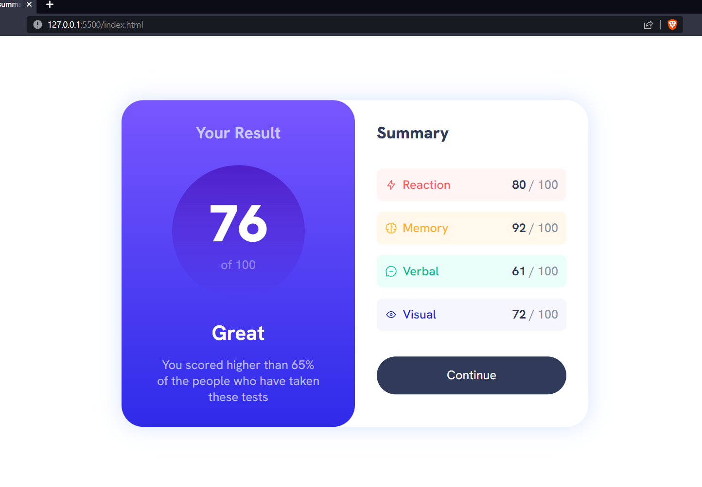
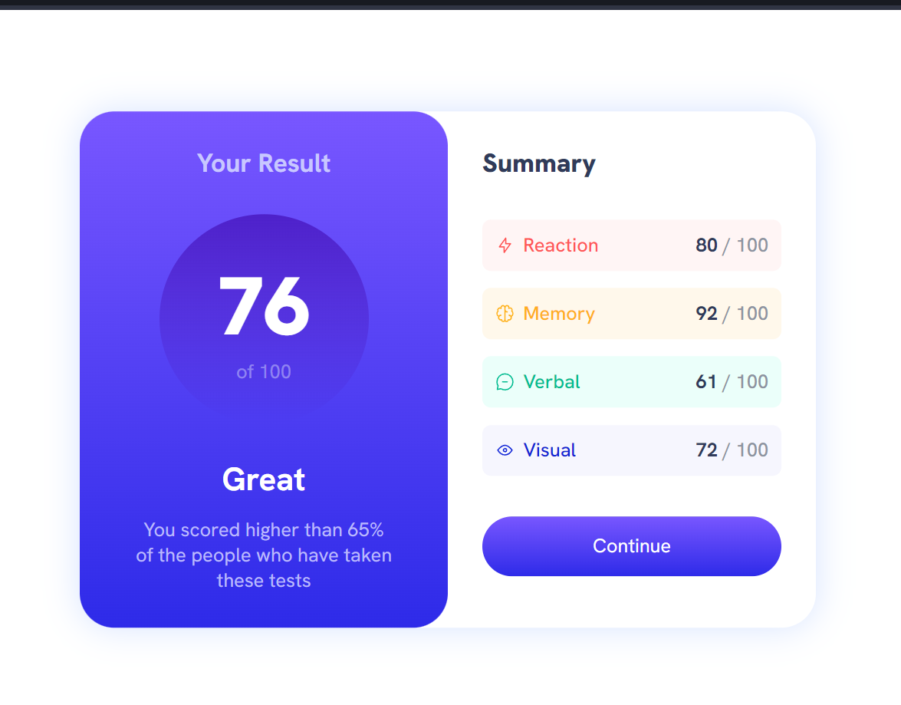
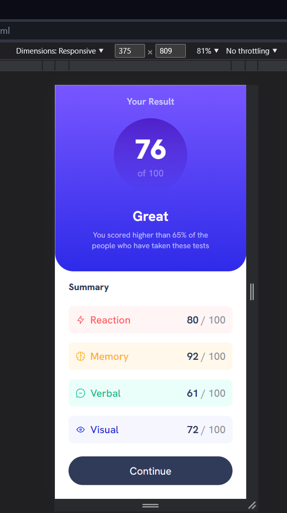
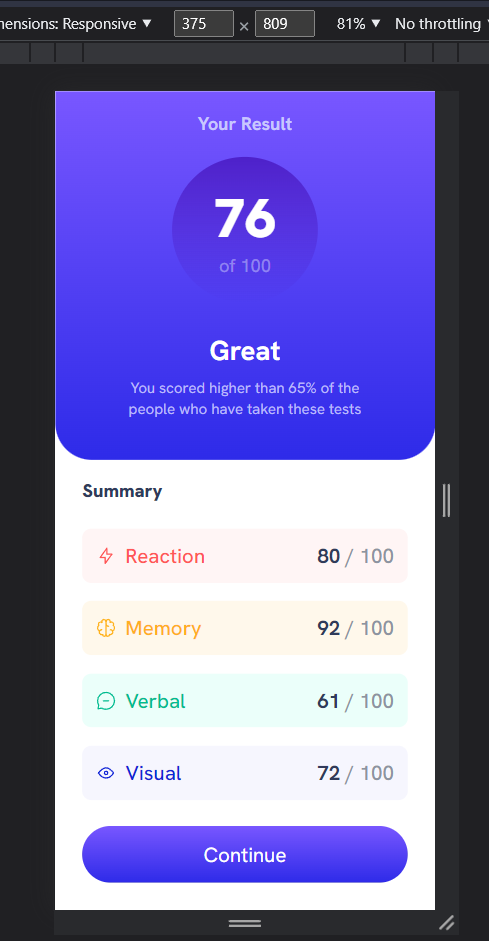

# Frontend Mentor - Results summary component solution

This is a solution to the [Results summary component challenge on Frontend Mentor](https://www.frontendmentor.io/challenges/results-summary-component-CE_K6s0maV). Frontend Mentor challenges help you improve your coding skills by building realistic projects. 

### Overview

  I am 100% beginner. You'll see that when you look at my code. Hehe
  Although I am a beginner, this is the first project that I've ever completed just by myself. I think, I finally stepped out from 'tutorial hell' and my 'comfort zone'.

### The challenge

Users should be able to:

- View the optimal layout for the interface depending on their device's screen size
- See hover and focus states for all interactive elements on the page

### Screenshot

### Links

- Live Site URL: [Add live site URL here](https://darling-marigold-6df5c5.netlify.app)

## My process

  Just straightforward building process from a person who is totally a beginner.

### Built with

- Semantic HTML5 markup
- Flexbox

### What I learned

  - How to reset css.
  - Concept of 'Flexbox'
  - Just little bit of responsive design 

### Continued development

- To get better at naming conventions (Bem etc.)
- Prevent repeating code
- Using semantic HTML

### Useful resources

- [Resource 1](https://www.w3schools.com) - The classic. Amazing resource for everything that related to coding.
- [Resource 2](https://nekocalc.com/px-to-rem-converter) - as the name says, I use it for converting units (px to rem)

## Author

- Frontend Mentor - [@egolam](https://www.frontendmentor.io/profile/egolam)
- Twitter - [@robot4qbu](https://www.twitter.com/robot4qbu)

## Acknowledgments
